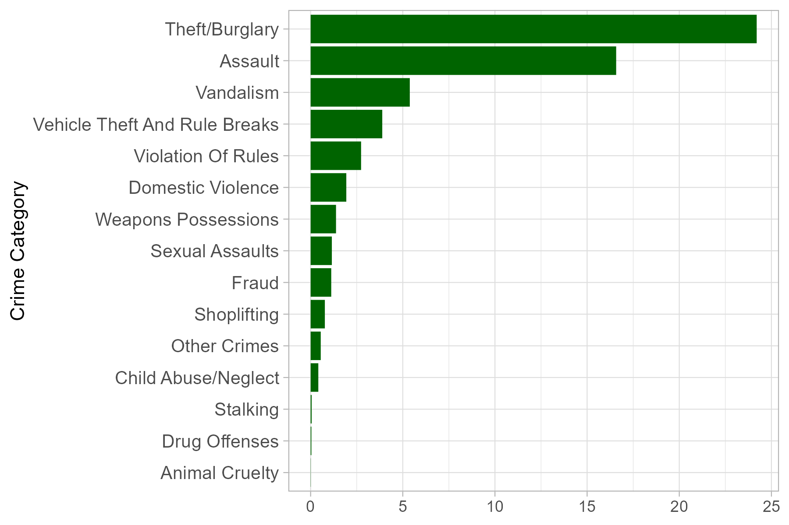
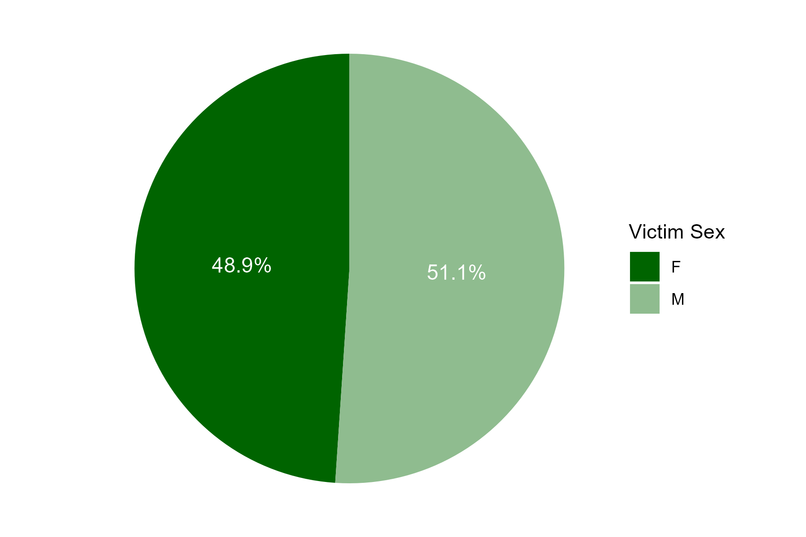
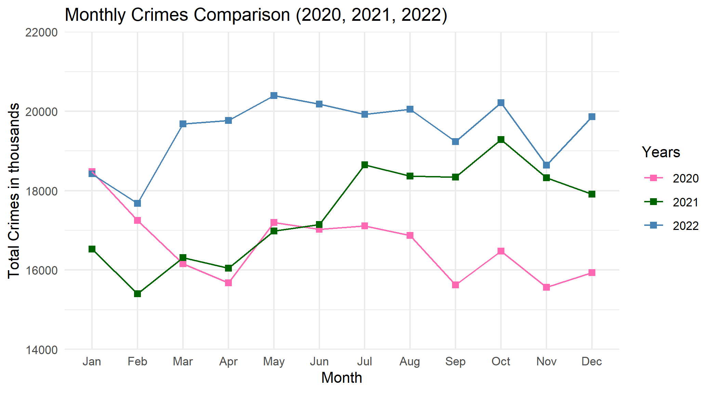

# Characterizing Crimes in Los Angeles (2020-2022)

## Overview

This project undertakes a thorough examination of crime patterns in Los Angeles from 2020 to 2022. Delving into the intricacies of criminal activities, the analysis addresses critical questions about changing crime counts, geographic hotspots, age-specific impacts, and gender disparities. Leveraging crime data from the Los Angeles Police Department, the study employs diverse analyses, including seasonal variations, geographical shifts, and crime-specific trends.

## Key Objectives

- Unveil the evolution of criminal activities in Los Angeles.
- Analyze changing crime counts and identify geographic hotspots.
- Investigate age-specific impacts and gender disparities in crime.
- Provide essential insights for policymakers and law enforcement.
- Contribute to the development of targeted strategies for a safer urban environment.

## Methodology

The project encompasses:
- Data exploration and manipulation.
- Diverse analyses, including seasonal variations and geographical shifts.
- Crime-specific trend analysis.
- Comprehensive categorization of crimes for structured analysis.
- Insightful visualizations for a nuanced understanding of crime dynamics.

## Research Questions

1. How has crime in Los Angeles changed over the past three years?
2. What are the geographic locations within Los Angeles that experienced the highest incidence of crime?
3. What age groups are affected by various types of crimes in Los Angeles?
4. How does the distribution of crime counts across different age groups vary by gender from 2020 to 2022?

## Data Sources

- Data File: Crime_Data_from_2020_to_Present.csv
- Date Downloaded: September 14, 2023
- Description: This dataset contains crime reports from Los Angeles dating back to 2020. The data is transcribed from original crime reports recorded on paper, so there may be some errors. Missing location fields are denoted as (0°, 0°), and addresses are provided only to the nearest hundred block to ensure privacy.
- Source: Data.gov
- Original Data Provider: Los Angeles Police Department

Data Validity: The dataset is sourced from an authentic authority (LAPD), but there may be biases due to data collection methods, reporting errors, and external socioeconomic factors.

## Data Manipulation

The dataset consists of 128 distinct offenses categorized into 15 main crime classifications:

1. Theft/Burglary - Unauthorized entry and larceny-related crimes.
2. Assault - Intentional harm or threats.
3. Vehicle Theft and Rule Violations - Unauthorized vehicle use and rule breaches.
4. Vandalism - Property destruction or defacement.
5. Violation of Rules - Breaches of established regulations.
6. Domestic Violence - Crimes within familial settings causing harm.
7. Shoplifting - Theft from commercial establishments.
8. Fraud - Financial deception and misrepresentation.
9. Weapons Possession - Illegal possession of weapons.
10. Sexual Assault - Non-consensual acts or harassment.
11. Child Abuse/Neglect - Mistreatment or neglect of children.
12. Stalking - Persistent and unwanted harassment.
13. Drug Offenses - Illegal possession, distribution, or trafficking of drugs.
14. Animal Cruelty - Harm or neglect of animals.
15. Other Crimes - Miscellaneous unclassified offenses.

## Findings

- Crime Trends: Theft/Burglary emerged as the most prevalent crime.
- Geographic Hotspots: Central Los Angeles had the highest crime rates, followed by 77th Street, Southwest, Pacific, and Hollywood.
- Age-Specific Impact: Individuals aged 21 to 30 were the most frequently victimized, followed by those aged 31 to 40.
- Gender Disparities: Males constituted 52.9% of crime victims, while females accounted for 47.1%.

  

# Seasonal Trends

A year-over-year analysis revealed:

- A decline in crime during the onset of the COVID-19 pandemic (2020), followed by a surge in 2021 and further escalation in 2022.
- Crime rates peaked in the summer months (May to October) and declined in winter.
- Factors such as unemployment, population growth, economic challenges, homelessness, and pandemic aftereffects influenced the rise in crime rates.
- Increased tourism and school vacations contributed to spikes in petty crimes and vandalism during the summer months.

Conclusion

This research provides a comprehensive analysis of crime trends in Los Angeles from 2020 to 2022. The insights gained serve as valuable resources for policymakers and law enforcement to craft targeted interventions and improve public safety. Future research directions include extending the study nationwide, incorporating additional socio-economic variables, and exploring evolving crime patterns over an extended timeframe. This project is shared openly to encourage collaboration, transparency, and further exploration within the data science and public policy communities.

Acknowledgments

Special thanks to the Los Angeles Police Department and Data.gov for making this dataset publicly available. This study is an effort to use data science for meaningful insights into urban safety and crime prevention.

